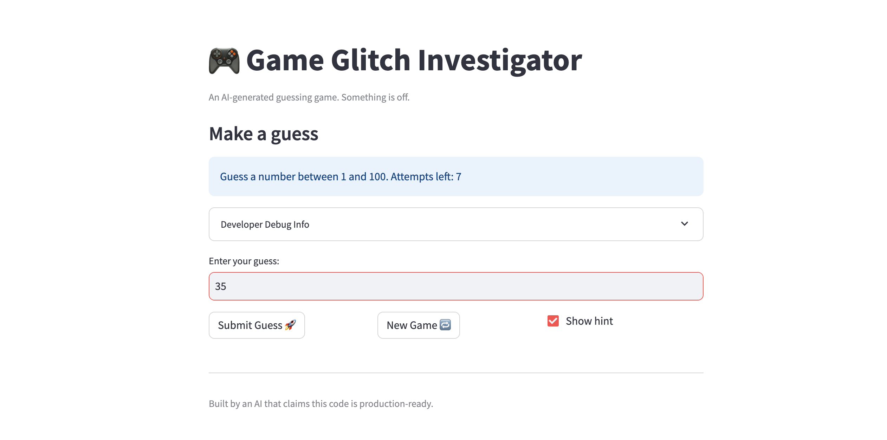
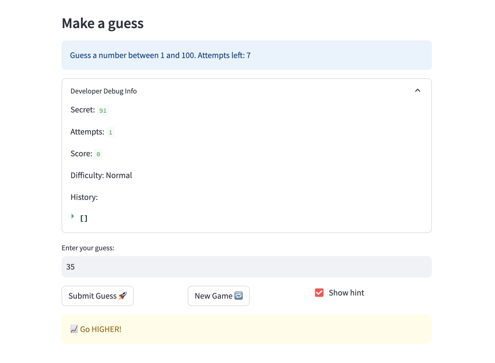
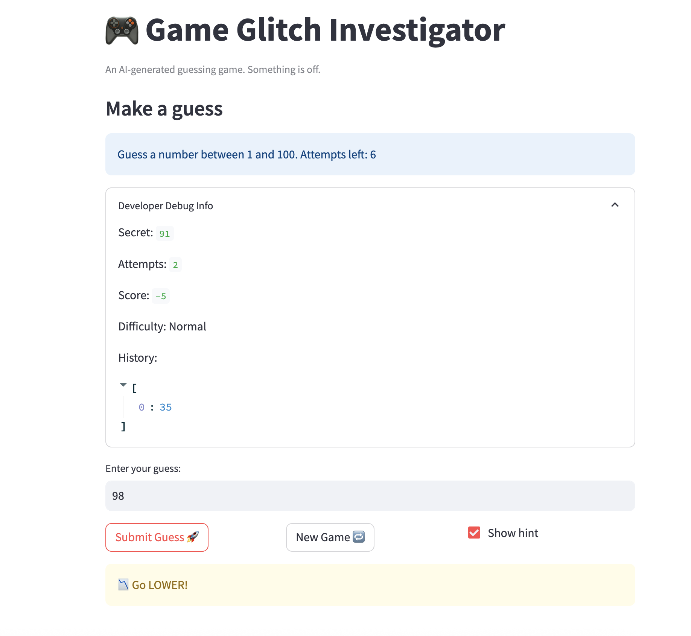
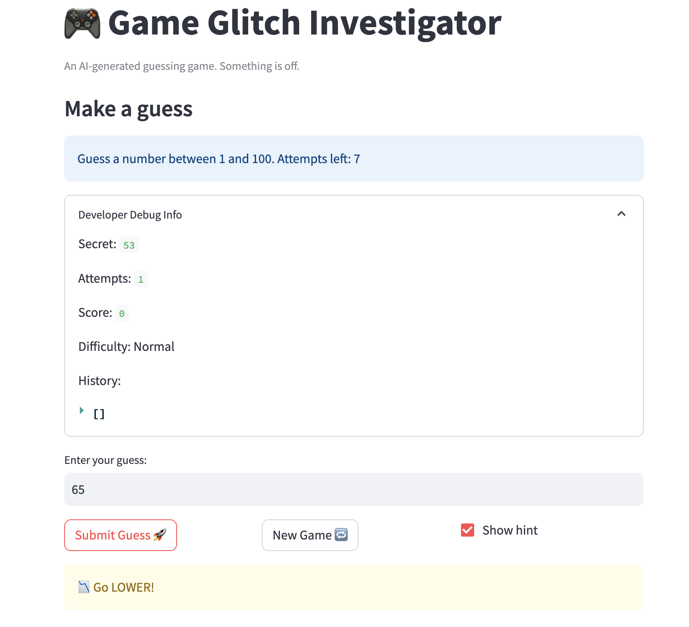
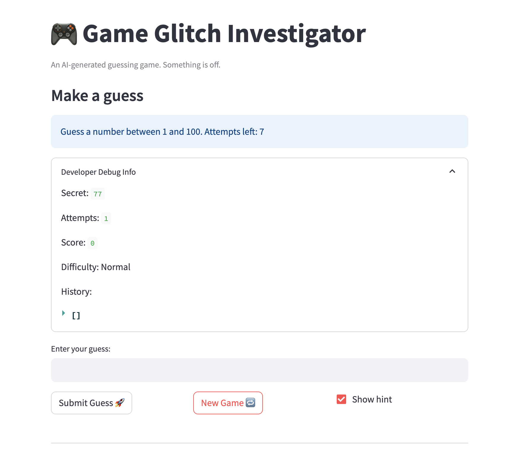

# 🎮 Game Glitch Investigator: The Impossible Guesser

## 🚨 The Situation

You asked an AI to build a simple "Number Guessing Game" using Streamlit.
It wrote the code, ran away, and now the game is unplayable. 

- You can't win.
- The hints lie to you.
- The secret number seems to have commitment issues.

## 🛠️ Setup

1. Install dependencies: `pip install -r requirements.txt`
2. Run the broken app: `python -m streamlit run app.py`

## 🕵️‍♂️ Your Mission

1. **Play the game.** Open the "Developer Debug Info" tab in the app to see the secret number. Try to win.
2. **Find the State Bug.** Why does the secret number change every time you click "Submit"? Ask ChatGPT: *"How do I keep a variable from resetting in Streamlit when I click a button?"*
3. **Fix the Logic.** The hints ("Higher/Lower") are wrong. Fix them.
4. **Refactor & Test.** - Move the logic into `logic_utils.py`.
   - Run `pytest` in your terminal.
   - Keep fixing until all tests pass!

## 📝 Document Your Experience

- [x] Describe the game's purpose.
This project is a Streamlit number guessing game where the player chooses a difficulty, guesses a secret number, gets higher or lower hints, and tries to win within a limited number of attempts while tracking score and history.

- [x] Detail which bugs you found.
I found that the hint directions were backwards, the New Game button did not fully reset the game, the old guess stayed in the input box after starting a new game, and mixed int/string comparisons caused incorrect results such as `check_guess(9, "10")` and `check_guess(50, "50")`.

- [x] Explain what fixes you applied.
I moved the helper functions into `logic_utils.py`, fixed `check_guess` so it compares values numerically and returns the correct hint direction, added an equality check for string/int edge cases, and fixed the New Game flow so it resets attempts, score, status, history, and secret correctly. I also added a `game_id` key in session state so the guess input box clears when a new game starts, and I verified the fixes with pytest and manual browser testing.

## 📸 Demo

- [x] Fixed a guess screen showing the correct hint direction, like Too High with “Go LOWER” or Too Low with “Go HIGHER.”

- [x] Fixed a New Game reset

## 🚀 Stretch Features

- [ ] [If you choose to complete Challenge 4, insert a screenshot of your Enhanced Game UI here]
